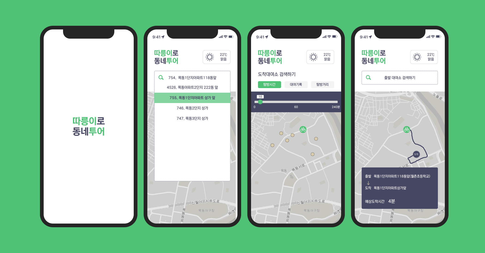
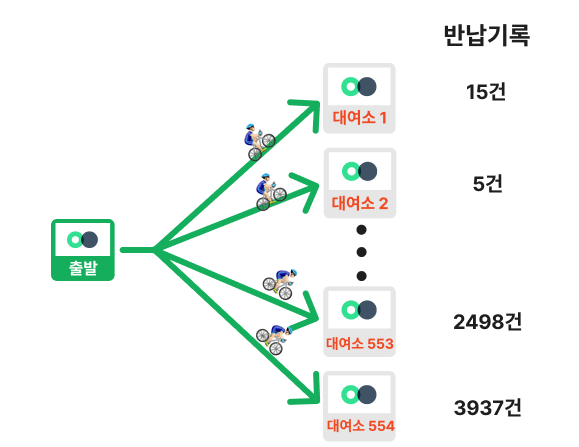
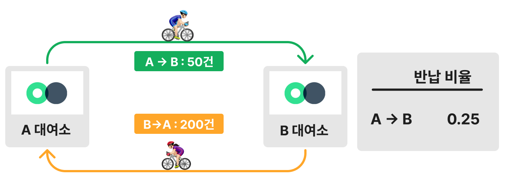
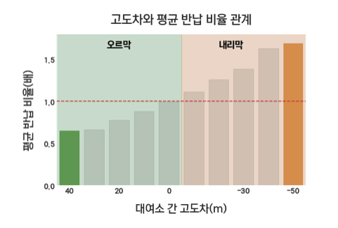
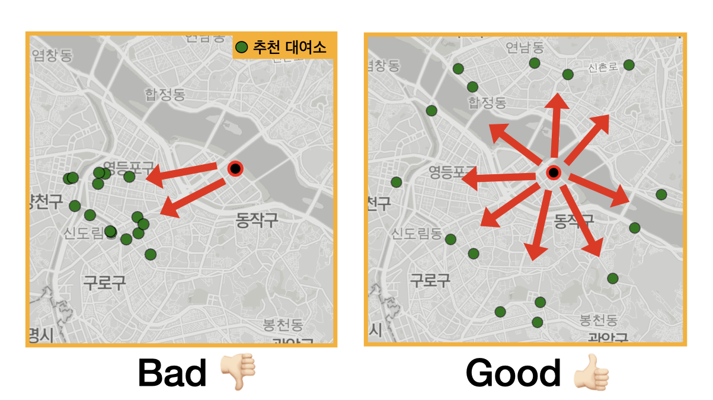
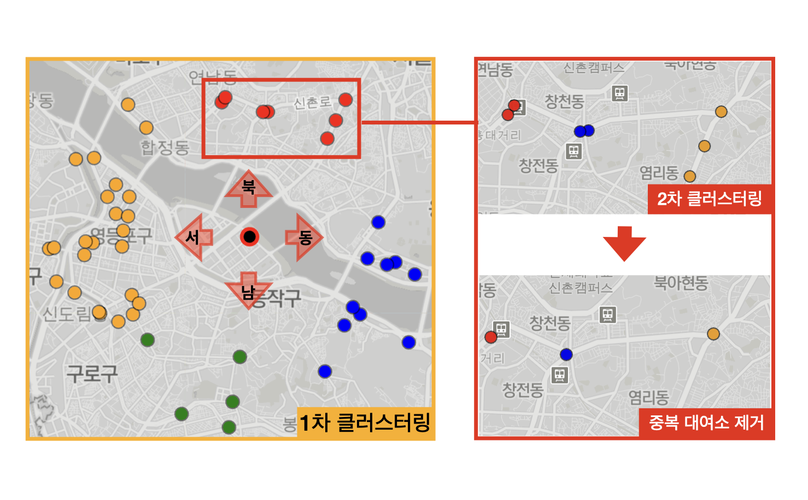
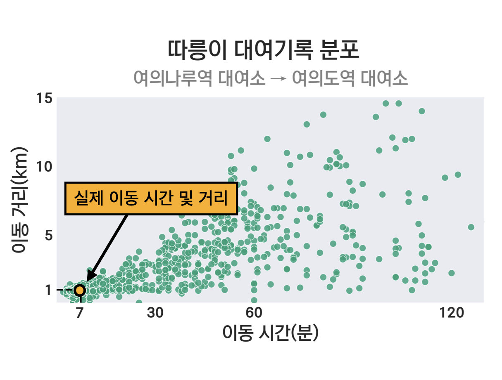
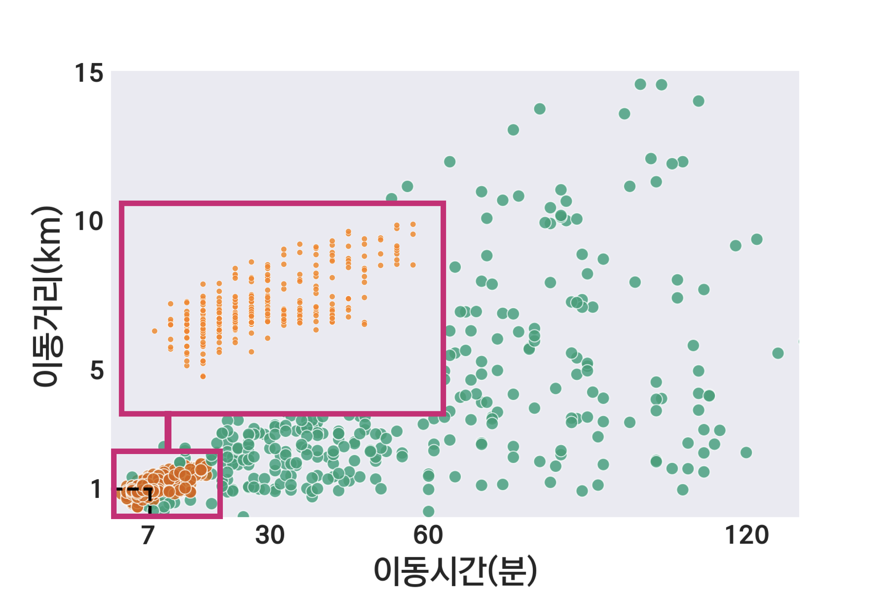

    

<!-- 
 <h2> 따릉이로 이동하며 주변 동네의 새로운 모습을 발견하세요!</h2> -->

 <h2> 따릉이를 이용해 주변 동네의 새로운 모습을 발견하세요!</h2>

**[프로젝트 소개](#introduction)**
**&nbsp;|&nbsp; [주요 기능](#features)**
**&nbsp;|&nbsp; [사용법 소개](#tutorial)**
**&nbsp;|&nbsp; [앱 사용하기](#apps)**
**&nbsp;|&nbsp; [활용 데이터](#dataset)**
**&nbsp;|&nbsp; [코드 보기](#code)**
**&nbsp;|&nbsp; [문제정의 및 해결](#development)**

<!-- 

    

 -->

<!-- [프로젝트 소개](#introduction)
• [주요기능](#features)
• [사용법](#tutorial)
• [앱 사용하기](#app)
• [아키텍쳐](#architecture)
• [활용 데이터](#dataset)
• [제작 과정 소개](#development)
• [느낀점](#paragraph2) -->

 
 

## 프로젝트 소개 

- 따릉이로 동네투어는 **따릉이를 타고 주변 동네를 탐방할 수 있는 목적지를 추천**하는 앱입니다.

- **자신만의 경로를 개척하는 과정에서 동네 여행의 재미를 느낄 수 있습니다.** 새롭게 발견한 동네 풍경을 감상하고 새로운 음식점, 카페 등을 발견하며 여행하는 재미를 느껴보세요.

 

## 주요 기능 

- 따릉이로 여행하기 적합한 대여소 추천
- 실제 대여기록에 기반한 예상 도착시간 및 예상 거리 제공

 

## 사용법 소개 

    

<h4>1. 출발 대여소를 검색하세요.</h4>

- 자주 이용하는 대여소나 이용하고 싶은 대여소를 검색하세요.
- 위치 검색을 허용하시면 인근 대여소를 지도에 제공합니다.

<h4>2. 도착 대여소를 선택하세요.</h4>

- 가고 싶은 지역 또는 방향을 생각한 다음 대여소를 찾아보세요.

<h4>3. 필터 기능을 사용하세요.</h4>

- 이동시간, 이동거리를 조절해 목적지를 쉽게 찾아보세요.

<h4>4. 예상시간과 예상거리를 확인하세요.</h4>

- 도착 대여소를 선택 했다면, 예상시간과 예상거리를 참고해 본인의 체력에 맞는 여정인지 확인하세요.
- 따릉이로 동네투어에서 제공하는 시간과 거리는 실제 대여기록을 바탕으로 제공되므로 다른 지도 앱보다 정확합니다. :metal:

<h4>5. 이동 경로를 참고하세요.</h4>

- 앱에서 제공하는 경로를 참고해 본인만의 경로를 개척해보세요.

<h4>6. 여행 준비는 끝났습니다. 마음이 끌리는 길을 따라 목적지까지 여행하세요! :rocket:</h4>

 

## 앱 사용하기 

누구나 편리하게 사용할 수 있도록 웹앱으로 제작했습니다. 아래 아이콘을 클릭해주세요.

 

## 코드 보기 

폴더구조와 파일 별 기능은 이동 한 페이지 내 설명란을 참고해주세요.

<a href="https://naver.com">**Analysis**</a> &nbsp; | &nbsp; <a href="https://github.com/yangoos57/seoulBikeProject/blob/main/backend/bikeTourUtils.py" >**Backend**</a> &nbsp; | &nbsp; <a href="https://github.com/yangoos57/seoulBikeProject/tree/main/frontend/src/components/bt">**Frontend**</a>

 

## 활용 데이터 

- 서울 공공데이터 포털에서 확보한 `2021년 따릉이 대여기록` 데이터 활용
- 따릉이 대여기록은 Raw 3,000만건, 6개 column(`자전거 번호`, `대여날짜`, `대여 대여소 번호`, `반납 대여소 번호`,`이용시간`, `이용거리`)으로 구성
- 이용시간과 이용거리를 활용해 `분당 이동거리`라는 새로운 Feature을 만들어 대여기록 300만건을 제거, 총 2,700만건의 데이터로 분석을 진행
- 따릉이 대여소 관련 일반사항
  - 서울 전역에 약 2600여개의 따릉이 대여소가 존재
  - 대여소 하나 당 8,000 ~ 120,000 사이의 대여기록을 보유
  - **하나의 대여소에서 출발한 자전거는 인근 수백개 대여소에 분산, But 20%의 대여소에 90% 자전거가 집중적으로 이동, 10%의 자전거만이 나머지 80%의 대여소로 이동**
      

      
      

 

## 문제정의 및 해결 

### 상관관계 분석을 통해 자전거 여행 적합하지 않은 대여소 제거

**문제 정의**

- 오르막길이 있는 경로를 이용할 경우 체력적인 부담으로 인해 자전거 여행을 온전히 즐기지 못할 가능성 존재
- **경로 상 오르막길이 있을 것으로 판단되는 대여소 식별 및 제거 필요**

**문제 해결**

- 대여비율 차이가 발생하는 원인을 분석해 경로 상 오르막길이 포함될 것으로 판단되는 대여소 식별
- A 대여소에서 B 대여소로 이동 기록은 200건인 반면, B 대여소에서 A 대여소로의 이동 기록은 50건으로 **4배의 대여비율 차이 발생**
    

        
    

- 같은 경로를 이용함에도 비율 차이가 발생하는 원인을 찾기 위해 EDA 진행, 대여비율과 대여소 고도 차이 간 상관관계 식별
- 상관관계 식별을 위해 사용한 식은 다음과 같음
- 대여비율 = $\large log_{2}(\frac{A→B {\;} 대여건수}{B→A \; 대여건수})$ &nbsp;|&nbsp; 대여소 고도차 = 출발지 고도 - 목적지 고도
- 초록색 영역은 출발 대여소 → 도착 대여소 경로가 오르막인 경우를, 주황색 영역은 출발 대여소 → 도착 대여소 경로가 내리막인 경우를 의미
   

       
   

- 그래프를 통해 오르막 영역에서는 고도차가 작을수록 대여비율이 증가하고, 내리막 영역에서는 고도차가 클수록 대여비율이 증가하는 양상을 확인 할 수 있음
- 대여비율이 -0.5 미만인 대여소의 경우, 경로 상 오르막길이 존재할 것으로 판단해 해당 대여소 제거

 

### KMeans를 활용한 대여소 선정 및 중첩 대여소 제거

**문제정의**

- 왼쪽 지도와 같은 방식으로 대여소를 추천할 경우 사용자는 비슷한 경로의 대여소를 중첩 추천받는 문제 발생
- 대여소 개수가 많더라도 실제 사용자가 이용하는 경로는 제한적임
- 반면 오른쪽 지도와 같이 여러 방향에 위치한 대여소를 추천할 경우 다양한 경로 이용 가능
- **사용자가 다양한 경로를 이용해 집 주변을 탐방 할 수 있도록 여러 방향에 위치한 대여소 추천 필요**
   

       
   

**문제해결**

- Kmeans를 두 번에 걸쳐 적용해 다양한 방향에 위치한 대여소 확보 및 중첩 대여소 제거
- 1차 클러스터링을 통해 출발 대여소 기준 동서남북 네 군집으로 구분
- 군집 별 2차 클러스터링 진행 및 중복 대여소 제거
  

  
  

 

### 예상시간과 예상거리 계산을 위한 DBSCAN 활용

**문제정의**

- 개별 자전거의 이용시간과 이용거리를 활용해 대여소까지 예상시간과 예상거리를 계산하는데 어려움이 존재
- 일례로 `여의나루역 대여소`에서 `여의도역 대여소`까지 이동 시 이용거리 1km 내외 이용 시간 7분 내외로 이동 가능
- 대여기록에서 확보한 범위는 이용시간 3 ~ 120분, 이용거리 1 ~15km로 존재
  

  
  

- 따릉이 이용 목적이 다양하므로 해당 분포를 오류로 판단 할 수 없음.
- **따릉이 데이터 내 대여소 이동이 목적인 대여기록 식별 및 추출 필요**

**문제해결**

- DBSCAN을 활용해 대여소와 대여소 이동 수단으로 따릉이를 이용하는 경우를 추출
- 따릉이를 대여소 이동 수단으로 이용하는 경우 효율적인 경로를 이용하므로 비슷한 이용거리, 이용시간대로 대여기록이 밀집
- 해당 사용자들의 대여기록은 밀집 된 특성 상 다른 대여기록과 구분 가능
    

    
    

- 여러 그룹이 식별될 경우 빈도수가 가장 많은 군집을 선택, 이는 따릉이 이용 목적 중 이동 수단으로 활용하는 경우가 가장 많기 때문
- DBSCAN으로 추출된 군집에 가중평균을 이용하여 대여소까지 예상시간과 예상거리를 산출

<!-- ## 프로젝트를 진행하며 느낀점 

### 데이터를 융합해 새로운 결과를 만들어낸 경험

서울 고도 데이터와 따릉이 데이터를 융합해 고도 차이와 대여소 반납 비율의 상관관계를 발견했습니다. 이러한 분석 결과를 활용해 여행에 불필요한 대여소를 정확하게 제거했고, 결과적으로 대여소 추천 정확도를 높혔습니다.

이러한 경험을 통해, 다양한 데이터와 융합해서 기존에 있는 데이터를 다시 해석하는 방식이 성과가 있음을 알게 됐습니다. 데이터 분석을 진행할 때 다양한 데이터를 활용해 기존의 데이터를 다시 해석하는 시도를 하는데 긍정적인 영향을 미칠 수 있다고 생각합니다.

 

### 앱 개발 및 배포 경험

데이터 분석의 경우 군에서 많은 경험이 있었지만 분석 결과를 실제로 활용하는 것은 제 몫이 아니었습니다. 결과를 직접 활용해서 뭔가 사람들에게 영향을 줄 수 있는 사용자들이 좀 사용해 볼 수 있고 실제로 어떤 기능을 갖고 있는 최종적인 생산물을 만들어 낸다는 것에서 개인적인 성취감을 느꼈습니다.

한편으로는 이경험이 나중에 다른 분야의 사람들과들을 할 때 특히 개발 분야에 있는 사람에게도 일할 때 도움이 될 수 있을 거라고 생각합니다 .그들의 언어를 제가 습득을 하고 있고 앞으로도 계속 습득 할 예정이기 때문에 그들의 언어로 최대한 이야기를 할 수있고 그래 통해서 어떤 시너지 효과를 기대할 수 있을 거라 생각합니다. -->

  
