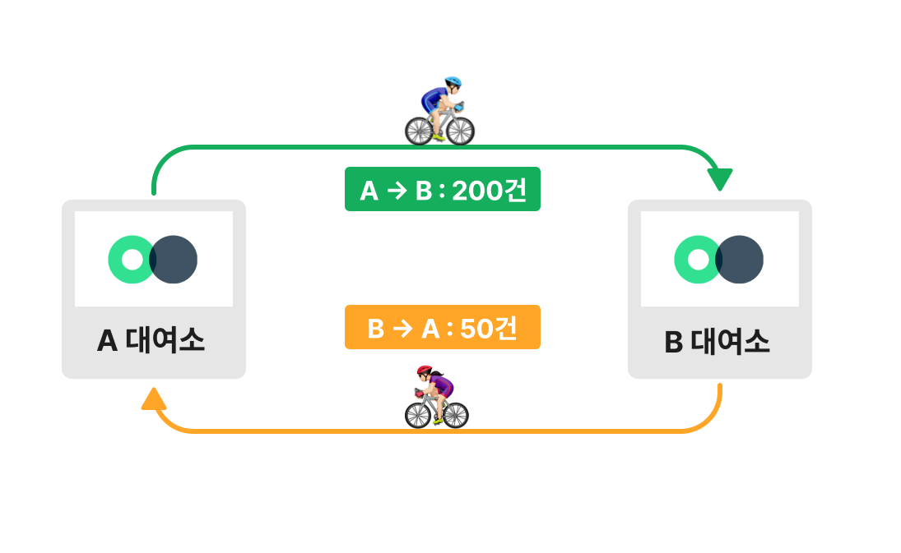
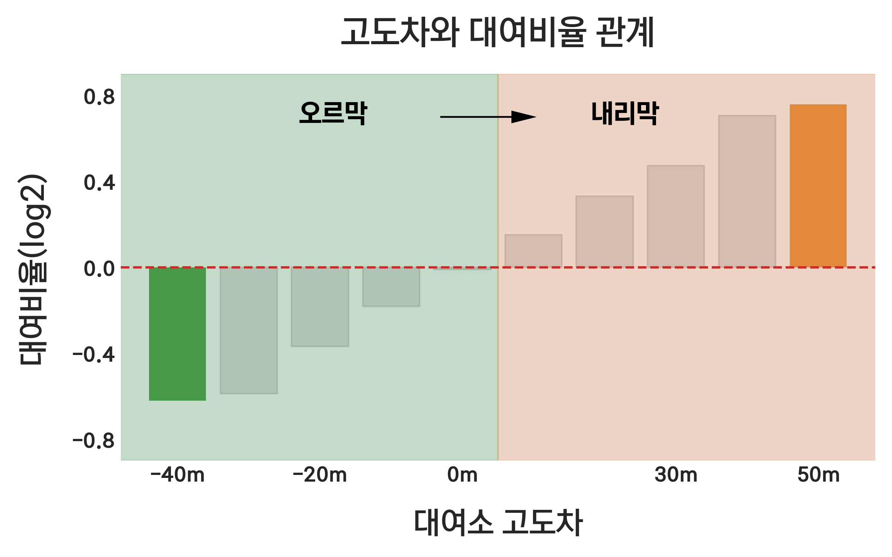

    

<!-- 
 <h2> 따릉이로 이동하며 주변 동네의 새로운 모습을 발견하세요!</h2> -->

 <h2> 따릉이를 이용해 주변 동네의 새로운 모습을 발견하세요!</h2>

**[프로젝트 소개](#introduction)**
**&nbsp;|&nbsp; [주요 기능](#features)**
**&nbsp;|&nbsp; [사용법 소개](#tutorial)**
**&nbsp;|&nbsp; [앱 사용하기](#apps)**
**&nbsp;|&nbsp; [활용 데이터](#dataset)**
**&nbsp;|&nbsp; [제작 과정 소개](#development)**
**&nbsp;|&nbsp; [프로젝트를 진행하며 느낀점](#takeaway)**

<!-- 

    

 -->

<!-- [프로젝트 소개](#introduction)
• [주요기능](#features)
• [사용법](#tutorial)
• [앱 사용하기](#app)
• [아키텍쳐](#architecture)
• [활용 데이터](#dataset)
• [제작 과정 소개](#development)
• [느낀점](#paragraph2) -->

 
 

## 프로젝트 소개 

- 따릉이로 동네투어는 **따릉이를 타고 주변 동네를 탐방할 수 있는 목적지를 추천**하는 앱입니다.

- **자신만의 경로를 개척하는 과정에서 동네 여행의 재미를 느낄 수 있습니다.** 새롭게 발견한 동네 풍경을 감상하고 새로운 음식점, 카페 등을 발견하며 여행하는 재미를 느껴보세요.

## 주요 기능 

- 따릉이로 여행하기 적합한 대여소 추천
- 실제 대여기록에 기반한 예상 도착시간 및 예상 거리 제공

## 사용법 소개 

    

<h4>1. 출발 대여소를 검색하세요.</h4>

- 자주 이용하는 대여소나 이용하고 싶은 대여소를 검색하세요.
- 위치 검색을 허용하면 인근에 있는 대여소를 제공합니다.

<h4>2. 필터 기능을 사용하세요.</h4>

- 여행시간, 여행거리를 조절해 목적지를 쉽게 찾아보세요.

<h4>3. 도착 대여소를 선택하세요.</h4>

- 가고 싶은 지역이나 방향을 생각한 다음 대여소를 선택한다면 알맞은 여행지를 찾으실 수 있습니다.

<h4>4. 예상 시간과 예상 거리 정보를 확인하세요.</h4>

- 앱에서 제공하는 예상시간과 예상거리를 참고해서 본인의 체력에 맞는 여정인지 확인하세요.
- 따릉이로 동네투어에서 제공하는 시간과 거리는 실제 대여기록을 바탕으로 제공되므로 다른 지도 앱보다 정확합니다. :metal:

<h4>5. 이동 경로를 참고하세요.</h4>

- 앱에서 제공하는 경로를 참고해 본인만의 경로를 고민해보세요.

<h4>6. 여행 준비는 끝났습니다. 마음이 끌리는 길을 따라 목적지까지 여행하세요! :rocket:</h4>

## 앱 사용하기 

누구나 손쉽게 사용할 수 있도록 웹앱으로 제작했습니다. 아래 아이콘을 클릭해주세요.

## 활용 데이터 

서울 공공데이터 포털에서 확보한 `2021년 따릉이 대여기록` 데이터를 활용했습니다. 해당 데이터는 Raw 3,000만건 6개 column(`자전거 번호`, `대여날짜`, `대여 대여소 번호`, `반납 대여소 번호`,`대여 시간`, `이동거리`)로 구성되었습니다.

전처리 과정에서 대여 시간과 이동 거리를 활용해 분당 이동거리라는 새로운 항목을 만들었습니다. 이를 활용해 오류가 있는 대여 기록 300만건을 제거해 총 2,700만건의 데이터로 분석을 진행했습니다.

따릉이 대여소 관련 기본사항은 다음과 같습니다.

- 서울 전역에 약 2600여개의 따릉이 대여소가 존재
- 1년간 약 3,000만건의 대여기록 발생, 대여소 별 편차가 큼. 대여소 당 8천에서 12만 건 사이의 대여기록을 보유.
- 하나의 대여소에서 출발한 자전거는 인근 수백개의 대여소에 분산되어 반납. **But 90% 자전거가 20%의 대여소에 집중적으로 반납, 10%의 자전거만이 나머지 80%의 대여소로 반납**
    

        
    

## 제작 과정 소개 

<!--   -->

### 세부 목표

여행에 적합한 따릉이 대여소를 찾기 위해 다음과 같은 세부 목표를 정했습니다.

1.  여행 경로가 편리한 대여소를 찾는다.
    따릉이로 동네투어는 목적지까지 최적의 경로를 추천하는 앱이 아닙니다. 목적지까지 이동하는 과정에서 사용자가 새로운 동네의 모습을 구경할 수 있도록 따릉이 이동에 적합한 대여소를 추천하는 앱입니다.

    사용자가 따릉이로 이동하며 새롭게 발견한 동네를 구경하는 재미를 느끼기 위해서는 **심리적으로 편안한 상태가 유지**되어야 합니다. 가령 경로 상 차량 이동이 잦아 자전거 운전에 신경써야하는 경우나 오르막길이 있어 체력적으로 어려움을 느끼게 된다면 사용자는 주변을 구경할 여유가 없게 됩니다.

    그러므로 이러한 경로가 예상되는 대여소를 찾아 제거함으로써 사용자가 따릉이 동네 여행을 즐길 수 있도록 도와야 합니다.

<!-- 2.  다양한 방향에 위치한 대여소를 추천한다. 골고루 배치되도록 . -->

2. 목적지가 한 지역에 몰려 있지 않도록 다양한 방향에 있는 대여소를 골고루 추천한다.

   한 지역에 목적지가 몰려 있다면 다른 목적지를 선택하더라도 사용자는 비슷한 경로를 이용하게 됩니다. 해당 경로가 익숙해지면 아무리 많은 목적지를 추천한다 한들 주변 동네를 여행하는 재미를 느낄 수 가 없습니다.

   따라서 사용자에게 다양한 경로를 개발 할 수 있도록 여러 방향에 위치한 대여소를 추천해야 합니다.

   왼쪽 지도처럼 추천 대여소가 몰려있다면 사용자가 경로를 새롭게 개척할 여지가 없게 됩니다. 반면 오른쪽 지도와 같이 출발 대여소를 기준으로 고르게 퍼져있다면 사용자는 여러 위치에 있는 목적지를 활용해 다양한 경로를 개척할 수 있습니다.
   

       
   

### 대여소 정제 단계 소개

앞서 설명한 두 가지 목표는 3단계의 과정을 통해 달성됩니다. 3단계의 정제 과정을 거치면 400~1600개 대여소가 최종적으로 25 ~ 50개 대여소로 정제됩니다.

<!--   -->

    

<!--   -->

### 0단계 : 사용자가 선택한 대여소의 대여기록 추출

3,000만 건의 raw 데이터 중 사용자가 **출발지로 선택한 대여소의 대여기록을 추출**합니다.
추출한 데이터를 활용해 해당 대여소와 대여 반납기록이 있는 대여소 정보를 확보합니다.
  

### 1단계 : 최소 반납 기록을 넘지 못하는 대여소 제거

첫번째 단계는 0단계에서 확보한 대여소 정보를 바탕으로 일정 수준 이하의 반납 기록을 보유한 대여소를 제거하는 단계입니다.

하나의 대여소와 상호작용하는 대여소는 수백개에 달합니다. 하지만 해당 대여소에서 출발한 자전거의 90%가 20% 대여소에 집중되며 나머지 10%의 자전거만이 80% 대여소에 분배됩니다.

나머지 80% 대여소가 반납 기록이 적은 이유로는 대여소까지 경로상 자전거로 이동하기 어려운 지형이 있거나, 대여소 주변을 갈만한 이유가 없는 경우, 또는 차량 이동이 잦은 경로를 지나야하므로 자전거 이용이 위험하기 때문입니다. 따라서 **반납 건수가 일정 수준 미만인 대여소를 제거함으로서 동네 여행에 적합하지 않은 대여소를 제거**할 수 있습니다.

아래 이미지에서 보듯 반납 기록이 적은 대여소를 제거함으로써 경로상 오르막길이 포함된 대여소들을 쉽게 제거할 수 있었습니다.

<!--   -->

    

<!--   -->
  

### 2단계 : 대여소 간 관계를 통해 적합하지 않은 대여소 제거

첫번째 단계가 최소한의 기준을 설정해 대여소를 제거하는 방식이라면, 두번째 단계는 대여소 별 관계를 파악해 적합하지 않는 대여소를 제거하는 방식입니다.

2단계를 진행하기 위해서는 우선 대여소 별 반납 비율을 구해야합니다. A 대여소에서 B 대여소로의 반납기록이 50건이고, B 대여소에서 A 대여소의 반납 기록이 200건이라고 생각해 보겠습니다.

그렇다면 A 대여소와 B 대여소의 반납 비율은 50/200 = 0.25가 됩니다. 이는 A 대여소와 B 대여소와의 관계에서 A 대여소의 대여기록이 B 대여소의 0.25배 임을 의미합니다.

    

출발지와 목적지만 바뀔 뿐 같은 경로를 이동 함에도 A 대여소의 기록은 B 대여소의 1/4 밖에 되지 않습니다.

이러한 불균형이 발생한 이유를 생각해보면 B 대여소에서 A 대여소로 가는 경로가 A에서 B 대여소로 가는 경로보다 편하기 때문이라 판단할 수 있습니다.

실제로 대여기록 데이터와 고도 데이터를 융합해 분석해보니 대여소의 고도차이와 대여 비율에 상관 관계가 있음을 확인했습니다.

<!--   -->

    

 

해당 그래프는 출발 도착 대여소 간 고도 차이와 반납 비율의 차이를 보여줍니다.
대여소 간 고도차이가 있는 경우 경로에 오르막길이 포함 된다는 말과 같습니다.

초록색 영역은 경로상 오르막이 있는 경우 이며 주황색은 내리막이 있는 경우입니다. 평균 반납 비율이 1.0라 함은 A -> B 대여기록과 B -> A 대여기록이 같음을 의미합니다.

그래프를 통해 고도차이와 평균 반납 비율간 상관 관계를 확인할 수 있습니다. 더 나아가
대여 비율을 통해 개별 대여소와의 관계를 알 수 있고, 반납비율이 낮을수록 해당 경로에 오르막 길이 있을 가능성이 높아진다고 생각할 수 있습니다.

따라서 촐발 대여소와 1단계에서 추출된 대여소들 간 반납 비율을 계산해 제거함으로서 따릉이로 동네 여행에 부적합한 대여소를 정제할 수 있습니다.

  

### 3단계 : K-means를 활용해 중첩 대여소 제거

최종 단계는 중첩된 대여소들을 제거하여 하나로 통합하는 단계입니다.

목적지로 방향에 따라 여행 경로가 결정되기 때문에 동일한 경로를 이용하는 대여소는 사실상 중복된 대여소라 할 수 있습니다. 방향을 보존함과 동시에 중첩된 대여소를 제거함으로써 사용자에 더 좋은 목적지를 추천할 수 있습니다.

중첩된 대여소를 찾고 제거하는 과정은 두 번의 K-menas Clustering을 통해 진행됩니다. 두 번의 클러스터링을 적용하는 이유는 출발 대여소를 기준으로 동일한 방향에 위치한 중첩 대여소를 쉽게 찾을 수 있기 때문입니다.

1차 클러스터링으로 큰 방향성을 정한 뒤 2차 클러스터링으로 세부 방향을 정하게 됩니다. 아래 지도를 보면 이동 방향이 비슷한 대여소는 같은 색으로 표현되고 있습니다. 방향이 같은(색이 같은) 대여소들에 다시 한번 클러스터링을 적용함으로서 해당 방향에서 다시 한 번 세부 방향을 정할 수 있습니다.

<!--   -->

    

<!--   -->

1차 클러스터링의 경우 출발 대여소와의 직선거리를 기준으로 구분한 뒤 클러스터링 기법을 적용합니다. 예로들어 출발 대여소와 2 ~ 4km 사이에 있는 대여소를 추출한 다음 추출된 대여소에 대해 클러스터링을 진행합니다.

이런 방식으로 4~6km, 6~8km, 8~10km 거리에 있는 대여소에도 순차적으로 클러스터링을 진행합니다. 거리를 구분해 클러스터링을 진행함으로써 다양한 거리의 목적지를 추천할 수 있습니다.

2단계는 군집 내 대여소들의 세부 방향을 정함과 동시에 중첩된 대여소를 하나로 통합하는 과정입니다. 1차로 라벨링 된 대여소들을 개별적으로 불러온 뒤 다시 한 번 클러스터링을 적용합니다. 두 번의 클러스터링을 거친 결과물은 최종 1~5개의 대여소가 됩니다.

1,2차 과정이 모두 완료되면 300 ~ 1000개 사이의 대여소가 25 ~ 50 개 대여소로 정제됩니다. 다양한 방향과 거리에 위치한 대여소만을 선택해 제공함으로써 사용자는 본인의 컨디션을 고려해 대여소를 선택할 수 있게 됩니다.

  

## 프로젝트를 진행하며 느낀점 

### 데이터를 융합해 새로운 결과를 만들어낸 경험

서울 고도 데이터와 따릉이 데이터를 융합해 고도 차이와 대여소 반납 비율의 상관관계를 발견했습니다. 이러한 분석 결과를 활용해 여행에 불필요한 대여소를 정확하게 제거했고, 결과적으로 대여소 추천 정확도를 높혔습니다.

이러한 경험을 통해, 다양한 데이터와 융합해서 기존에 있는 데이터를 다시 해석하는 방식이 성과가 있음을 알게 됐습니다. 데이터 분석을 진행할 때 다양한 데이터를 활용해 기존의 데이터를 다시 해석하는 시도를 하는데 긍정적인 영향을 미칠 수 있다고 생각합니다.

 

### 앱 개발 및 배포 경험

데이터 분석의 경우 군에서 많은 경험이 있었지만 분석 결과를 실제로 활용하는 것은 제 몫이 아니었습니다. 결과를 직접 활용해서 뭔가 사람들에게 영향을 줄 수 있는 사용자들이 좀 사용해 볼 수 있고 실제로 어떤 기능을 갖고 있는 최종적인 생산물을 만들어 낸다는 것에서 개인적인 성취감을 느꼈습니다.

한편으로는 이경험이 나중에 다른 분야의 사람들과들을 할 때 특히 개발 분야에 있는 사람에게도 일할 때 도움이 될 수 있을 거라고 생각합니다 .그들의 언어를 제가 습득을 하고 있고 앞으로도 계속 습득 할 예정이기 때문에 그들의 언어로 최대한 이야기를 할 수있고 그래 통해서 어떤 시너지 효과를 기대할 수 있을 거라 생각합니다.

  
