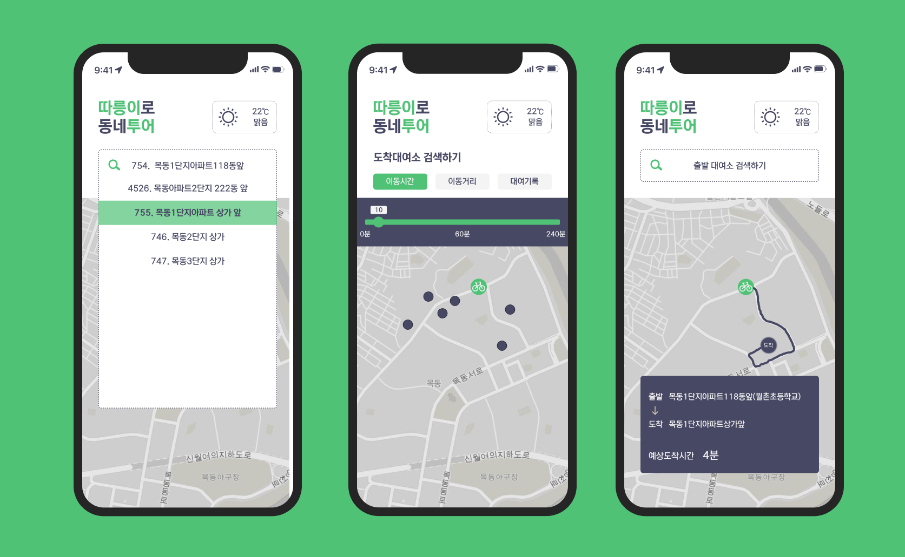
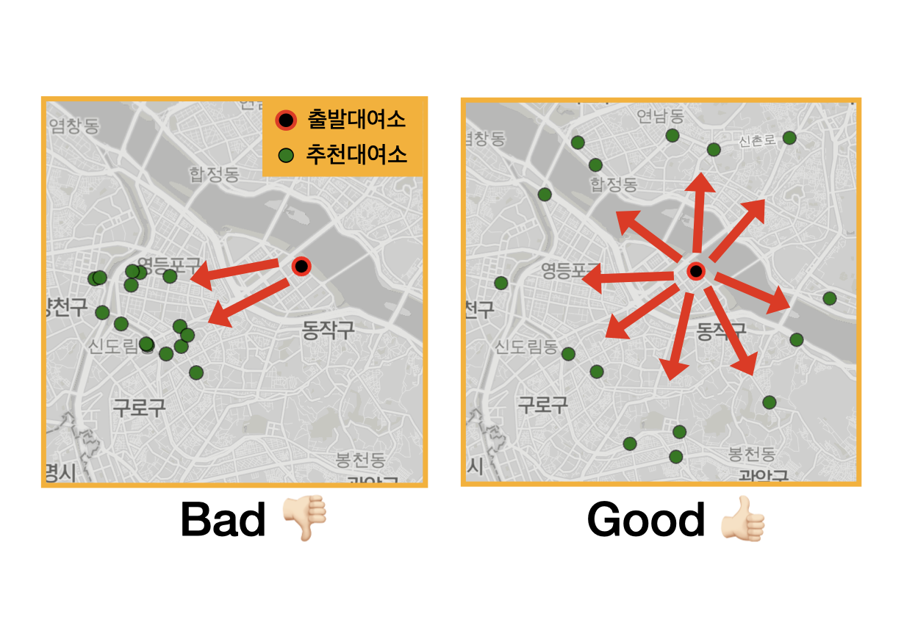

    

<!-- 
 <h2> 따릉이로 이동하며 주변 동네의 새로운 모습을 발견하세요!</h2> -->

 <h2> 따릉이를 이용해 주변 동네의 새로운 모습을 발견하세요!</h2>

**[프로젝트 소개](#introduction)**
**&nbsp;|&nbsp; [앱 사용하기](#apps)**
**&nbsp;|&nbsp; [사용법 소개](#tutorial)**
**&nbsp;|&nbsp; [활용 데이터](#dataset)**
**&nbsp;|&nbsp; [코드 보기](#code)**
**&nbsp;|&nbsp; [문제정의 및 해결](#development)**

<!-- 

    

 -->

<!-- [프로젝트 소개](#introduction)
• [주요기능](#features)
• [사용법](#tutorial)
• [앱 사용하기](#app)
• [아키텍쳐](#architecture)
• [활용 데이터](#dataset)
• [제작 과정 소개](#development)
• [느낀점](#paragraph2) -->

 

## 프로젝트 소개 

    

따릉이를 타고 집 주변을 여행하는 취미가 있습니다. 새로운 여행지를 찾기 위해 3,000만 건의 따릉이 대여기록을 분석하였습니다. feature engineering을 통해 300만건의 데이터를 전처리 하였으며 `자전거로 이동이 편리한 대여소`를 찾기 위해 clustering 모델을 활용해 EDA를 진행했습니다.

분석 결과를 시각화하고 편리하게 활용할 수 있도록 웹어플리케이션으로 제작했습니다. Django와 React 기반으로 제작했으며, Azure에 Docker 기반으로 배포했습니다. 추천 대여소를 지도에 시각화하기 위해 Leaflet.js를 활용했습니다.

 

## 앱 사용하기 

 

## 사용법 소개 

    

<h4>1. 출발 대여소를 검색하세요.</h4>

- 자주 이용하는 대여소나 이용하고 싶은 대여소를 검색하세요.
- 위치 검색을 허용하시면 인근 대여소를 지도에 제공합니다.

<h4>2. 도착 대여소를 선택하세요.</h4>

- 가고 싶은 지역 또는 방향을 생각한 다음 대여소를 찾아보세요.

<h4>3. 필터 기능을 사용하세요.</h4>

- 이동시간, 이동거리를 조절해 목적지를 쉽게 찾아보세요.

<h4>4. 예상시간과 예상거리를 확인하세요.</h4>

- 도착 대여소를 선택 했다면, 예상시간과 예상거리를 참고해 본인의 체력에 맞는 여정인지 확인하세요.

<h4>5. 이동 경로를 참고하세요.</h4>

- 앱에서 제공하는 경로를 참고해 본인만의 경로를 개척해보세요.

<h4>6. 여행 준비는 끝났습니다. 마음에 끌리는 길을 따라 목적지까지 여행하세요! :rocket:</h4>

 

## 코드 보기 

링크를 클릭하시면 코드를 확인하실 수 있습니다.

- <a href="https://github.com/yangoos57/seoulBikeProject/blob/main/backend/bikeTourUtils.py" >**백엔드**</a>
- <a href="https://github.com/yangoos57/seoulBikeProject/tree/main/frontend/src/components/bt">**프론트엔드**</a>

 

## 활용 데이터 

- 서울 공공데이터 포털에서 확보한 `2021년 따릉이 대여기록` 데이터 활용
- 따릉이 대여기록은 Raw 3,000만건, 6개 column(`자전거 번호`, `대여날짜`, `대여 대여소 번호`, `반납 대여소 번호`,`이용시간`, `이용거리`)으로 구성
- 이용시간과 이용거리 활용 `분당 이동거리`라는 새로운 Feature 생성 및 대여기록 300만건 제거, 총 2,700만건의 데이터로 분석 진행

 

## 문제정의 및 해결 

### 예상 도착시간과 이동거리 계산을 위한 DBscan 활용

**문제정의**

따릉이 대여기록을 활용해 예상 도착시간과 이동거리를 계산하고 싶었습니다. 따릉이 이용 목적이 다양한 만큼 `이동거리`, `이동시간`도 다양해 데이터 활용에 문제가 있었습니다. 예로들어 `여의나루역 대여소`에서 `여의도역 대여소`까지 실제 이용거리는 1km 내외이고 이용시간 7분 내외로 소요됩니다. 실제 대여기록의 분포는 이용시간 3 ~ 120분, 이용거리 1 ~15km로 그 범위가 넓어 특정 패턴을 가진 대여기록을 추출해야 했습니다.

  

  
  

**문제해결**

DBscan을 활용해 이동시간과 이동거리 계산에 필요한 데이터를 추출할 수 있었습니다. 이를 위해서 두 가지 가정을 수립했습니다.

- 첫째, 따릉이 이용 목적 대부분은 대여소 간 이동수단으로 활용이다.

- 둘째, 대여소 간 이동이 목적인 경우 비슷한 이동거리와 이동시간을 가진다.

이러한 가정을 기반으로 가장 밀집된 군집이 대여소 간 이동 목적인 대여기록이라고 판단하였고 DBscan을 활용해 밀집된 데이터를 추출할 수 있다고 생각했습니다.

실제로 DBscan을 활용해 비슷한 이동시간, 이동거리에 밀집한 데이터 군집을 추출할 수 있었고 해당 데이터를 가중평균하여 정확한 예상시간과 이동거리를 계산했습니다.

### KMeans를 활용한 대여소 선정 및 중첩 대여소 제거

**문제정의**

여행에 적합한 대여소만 선별하기 위해 중첩 대여소를 제거해야했습니다. 이때 대여소를 정제하는 과정에서 왼편 지도와 같이 한 방향으로 대여소가 추천되는 상황이 일어나지 않도록 해야했습니다. 오른편 지도와 같이 다양한 경로를 이용해 집 주변을 탐방할 수 있도록 대여소를 추천해야 했습니다.

    

**문제해결**

Kmeans를 통해 `중첩 대여소 제거`와 `다양한 방향에 위치한 대여소 보존` 두가지 목적을 달성했습니다. 이를 위해 2번에 걸쳐 Kmeans를 수행했습니다.

첫째, 출발 대여소를 기준으로 반경 1km 별 대여소를 추출합니다. 추출된 데이터에 4개의 centroid를 찾는 kmeans를 수행하면 동서남북 4 그룹으로 분류할 수 있습니다.아래 그림은 대여소에서 4~5km 사이에 위치한 대여소를 선별해 kmeans를 진행한 예시입니다.

둘째, 동서남북 그룹별 kmeans를 다시 한 번 수행합니다. 결과는 아래 그림과 같이 가까운 대여소 간 그룹이 형성 됩니다. 형성 된 그룹별로 하나의 대여소만 보존하고 나머지 대여소를 제거합니다.

두 번의 kmeans를 적용하여 세부 방향을 보존함과 동시에 중첩 대여소를 제거할 수 있었습니다.

  

  
  

 

<!-- ### 상관관계 분석을 통해 자전거 여행에 부적합한 대여소 제거

**문제정의**
자전거 이용에 가장 큰 난관은 오르막 입니다. 대여소 이동에 오르막이 포함된다면 해당 대여소는 여행에 적합하지 않은 대여소로 분류 되어야 합니다. 경로상 오르막이 있을 것으로 판단되는 대여소를 제거할 방법이 필요했습니다.

**문제해결**

대여비율과 대여소간 고도 차이의 상관관계를 식별하여 일정 대여비율 이상인 경우 해당 경로에 오르막 길이 있다고 판단하여 대여소를 제거하였습니다. 개별 변수를 구하는 식은 다음과 같습니다.

- 대여비율 = $\large log_{2}(\frac{A→B대여건수}{B→A 대여건수})$ &nbsp;|&nbsp; 대여소 고도차 = 출발지 고도 - 목적지 고도

예를들어 A 대여소에서 B 대여소로 이동한 기록이 200건, 그 반대인 B 대여소에서 A 대여소로 이동한 기록이 50건인 경우 대여비율은 $\large log_{2}(\frac{200}{50}) = 2$ 로 계산할 수 있습니다. 대여소 고도차는 A 대여소가 고도 50m, B 대여소가 60m인 경우 -10이 됩니다.

    

아래 그래프는 대여소 고도차이와 대여비율의 관계를 보여줍니다. 따릉이 대여소는 약 2300여개이고 하나의 대여소는 200여개의 주변 대여소와 교류를 합니다. 약 460,000개의 대여비율과 대여소 고도차이를 계산한 결과이며 초록색은 오르막 대여소 고도차이가 클수록 대여비율의 차이가 커지고 있음을 확인할 수 있습니다.

    

- 초록색 영역은 출발 대여소 → 도착 대여소 경로가 오르막인 경우를, 주황색 영역은 출발 대여소 → 도착 대여소 경로가 내리막인 경우를 의미
- 그래프를 통해 오르막 영역에서는 고도차가 작을수록 대여비율이 증가하고, 내리막 영역에서는 고도차가 클수록 대여비율이 증가하는 경향을 확인 할 수 있음
- **대여비율이 -0.5 미만인 대여소의 경우, 경로 상 오르막길이 존재할 것으로 판단해 해당 대여소 제거**

  -->

<!-- ## 프로젝트를 진행하며 느낀점 

### 데이터를 융합해 새로운 결과를 만들어낸 경험

서울 고도 데이터와 따릉이 데이터를 융합해 고도 차이와 대여소 반납 비율의 상관관계를 발견했습니다. 이러한 분석 결과를 활용해 여행에 불필요한 대여소를 정확하게 제거했고, 결과적으로 대여소 추천 정확도를 높혔습니다.

이러한 경험을 통해, 다양한 데이터와 융합해서 기존에 있는 데이터를 다시 해석하는 방식이 성과가 있음을 알게 됐습니다. 데이터 분석을 진행할 때 다양한 데이터를 활용해 기존의 데이터를 다시 해석하는 시도를 하는데 긍정적인 영향을 미칠 수 있다고 생각합니다.

 

### 앱 개발 및 배포 경험

데이터 분석의 경우 군에서 많은 경험이 있었지만 분석 결과를 실제로 활용하는 것은 제 몫이 아니었습니다. 결과를 직접 활용해서 뭔가 사람들에게 영향을 줄 수 있는 사용자들이 좀 사용해 볼 수 있고 실제로 어떤 기능을 갖고 있는 최종적인 생산물을 만들어 낸다는 것에서 개인적인 성취감을 느꼈습니다.

한편으로는 이경험이 나중에 다른 분야의 사람들과들을 할 때 특히 개발 분야에 있는 사람에게도 일할 때 도움이 될 수 있을 거라고 생각합니다 .그들의 언어를 제가 습득을 하고 있고 앞으로도 계속 습득 할 예정이기 때문에 그들의 언어로 최대한 이야기를 할 수있고 그래 통해서 어떤 시너지 효과를 기대할 수 있을 거라 생각합니다. -->

  

  
