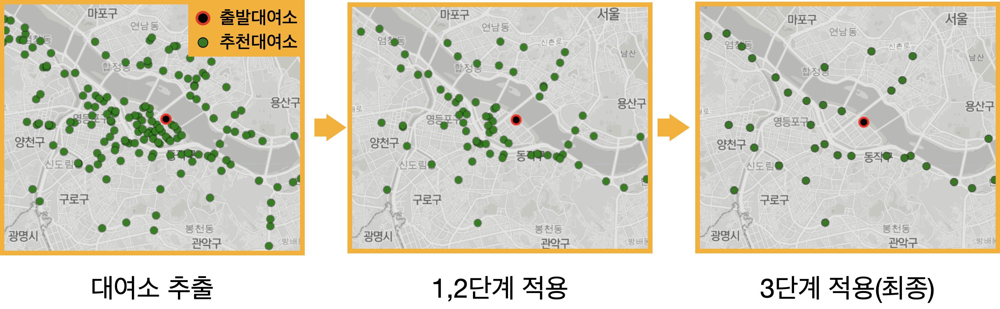
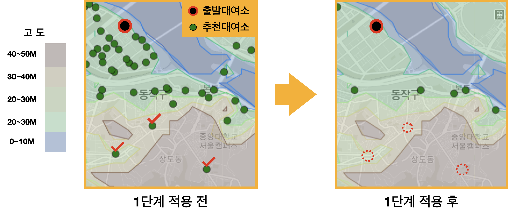

    

 <h2> 따릉이로 이동하며 주변 동네의 새로운 모습을 발견하세요!</h2>

**[프로젝트 소개](#introduction)**
**&nbsp;|&nbsp; [주요기능](#features)**
**&nbsp;|&nbsp; [사용법](#tutorial)**
**&nbsp;|&nbsp; [앱 사용하기](#app)**
**&nbsp;|&nbsp; [아키텍쳐](#architecture)**
**&nbsp;|&nbsp; [활용 데이터](#dataset)**
**&nbsp;|&nbsp; [제작 과정 소개](#development)**
**&nbsp;|&nbsp; [느낀점](#paragraph2)**

 

<!-- 

    

 -->

<!-- [프로젝트 소개](#introduction)
• [주요기능](#features)
• [사용법](#tutorial)
• [앱 사용하기](#app)
• [아키텍쳐](#architecture)
• [활용 데이터](#dataset)
• [제작 과정 소개](#development)
• [느낀점](#paragraph2) -->

 
 

## 프로젝트 소개 

- 따릉이로 동네투어는 **따릉이를 타고 주변 동네를 탐방할 수 있는 목적지를 추천**하는 앱입니다.

- **동네 여행의 재미는 자신만의 경로를 개척하는 과정에서 느끼게 됩니다.** 따릉이로 동네투어를 통해 목적지를 선정하고 본인만의 경로로 이동하며 기존에 몰랐던 주변 동네 풍경을 감상하거나 새로운 음식점, 카페 등을 발견하면서 여행하는 재미를 느껴보세요.

## 주요기능 

- 동네 여행에 적합한 대여소 추천
- 실제 대여기록에 기반한 예상 도착시간 및 예상 거리 제공

## 사용법 소개 

    

<h4>1. 출발 대여소를 검색하세요.</h4>

- 위치 검색을 허용하면 집 주변 따릉이 대여소를 제공합니다.

<h4>2. 필터 기능을 사용하세요.</h4>

- 원하는 여행 시간, 목적지까지 예상 거리를 조절해 목적지를 쉽게 찾아보세요.

<h4>3. 도착 대여소를 선택하세요.</h4>

- 가고 싶은 지역이나 방향을 먼저 선정하고 대여소를 선택한다면 더욱 재밌는 여행을 즐기실 수 있습니다.

<h4>4. 예상 시간과 예상 거리 정보를 확인하세요.</h4>

- 대여소 클릭시 제공되는 예상시간, 예상거리를 참고해서 본인의 체력에 맞는 여정인지 확인하세요.
- 따릉이로 동네투어에서 제공하는 시간과 거리는 실제 따릉이 대여기록을 바탕으로 제공되므로 다른 지도 앱보다 정확합니다.

<h4>5. 이동 경로를 참고하세요.</h4>

- 앱에서 제공하는 경로를 참고해 본인만의 경로를 개척해보세요.

<h4> 6. 여행 준비는 끝났습니다. 마음이 끌리는 길을 따라 목적지까지 여행하세요! :rocket: </h4>

## 따릉이로 동네투어 사용하기 

누구나 간단하게 사용할 수 있도록 웹앱으로 제작했습니다. 아래 아이콘을 클릭해주세요.

## 아키텍쳐 

## 활용 데이터 

프로젝트에 사용한 데이터는 서울 공공데이터 포털에서 확보한 2021년도 따릉이 대여기록입니다.

해당 데이터는 Raw 3,000만건 column 6개(자전거 번호, 대여날짜, 대여 대여소 번호, 반납 대여소 번호,대여 시간, 이동거리)로 구성되었습니다.

전처리 과정에서 대여 시간과 이동 거리를 활용해 분당 이동거리라는 새로운 항목을 만들어 오류가 있는 대여 기록 400만건을 제거하여 총 2,600만건의 데이터를 활용해 분석을 진행했습니다.

따릉이 대여소 관련 기본적인 내용은 다음과 같습니다.

- 서울 전역에 약 2600여개의 따릉이 대여소가 존재
- 1년간 약 3,000만건의 대여기록 발생, But 대여소 별 편차가 큼. 대여소 당 8천에서 12만 건 사이의 대여기록을 보유.
- 하나의 대여소에서 출발한 자전거는 인근 수백개의 대여소에 분산되어 반납. **But 90% 자전거가 20%의 대여소에 집중적으로 반납, 10%의 자전거만이 나머지 80%의 대여소로 반납**

<!--   -->

    

## 대여소 추천 모델 개발 

<!--   -->

목적지를 제거하는 과정은 3단계로 진행됩니다. 400~1600개 대여소가 3단계 전처리를 통해 25 ~ 50개 대여소로 정제됩니다.

<!--   -->

    

<!--   -->

### 0단계 : 전체 대여기록에서 사용자가 선택한 대여소의 대여기록 추출

따릉이로 동네여행이 목적지를 제공하는 방식은 개별 대여소의 반납 기록을 활용합니다. 사용자가 출발 대여소를 선택하면, 해당 대여소의 대여 기록을 바탕으로 반납된 대여소들을 추출합니다.

총 반납 기록이 있는 400 ~ 1600개 대여소를 활용해 앞으로 설명할 세 단계 처리절차를 거쳐 여행에 적합하지 않은 목적지를 제거하고, 다양한 방향에 위치한 목적지를 찾아 최종적으로 사용자에게 제공합니다. 이렇게 처리된 목적지는 대여소의 대여기록에 따라 25 ~ 50개로 선정 됩니다.
  

### 1단계 : 최소 반납 기록을 넘지 못하는 대여소 제거

첫번째 단계는 최소 기준을 설정해 넘지 못하는 대여소를 제거합니다. 하나에 대여소가 수백개의 대여소와 상호 작용을 하지만 반납기록은 고르게 분포되어 있지 않습니다.대여소 별로 반납 기록이 크게 차이나는 이유는 해당 대여소에 반납할 만한 유인이 있지 않기 때문입니다.

해당 대여소까지 가는 경로상에 자전거로 이동하기 어려운 지형 있거나, 주변을 갈만한 이유가 없을수도 있고, 차량 이동이 잦은 경로라 자전거 이용이 위험할 수 도 있습니다. 따라서 반납 건수가 일정 수준 미만인 대여소는 여행지로 갈만한 대여소로 구분 지을 수 있습니다.

최소한의 기준을 설정하여 불필요한 대여소를 제거한 결과 자전거로 이동하기 어려운 대여소들을 쉽게 제거할 수 있었습니다.

<!--   -->

    

<!--   -->
  

### 2단계 : 대여소 간 관계를 통해 적합하지 않은 대여소 제거

첫 번째 단계가 최소한의 기준을 설정해 대여소를 제거하는 방식이라면, 두 번째 단계는 대여소 별 관계를 파악해 적합하지 않는 대여소를 제거하는 방식입니다.

이 방식은 대여소 별 반납 비율을 구한 다음 진행합니다. 예로들어 A 대여소에서 B 대여소로의 반납기록이 50건이고, B 대여소에서 A 대여소의 반납 기록이 200건이라고 생각해 보겠습니다. 출발지와 목적지만 바뀔 뿐 같은 경로를 이동 함에도 A 대여소의 기록은 B 대여소의 1/4에 불과합니다.

<!--   -->

    

<!--   -->

불균형이 발생한 이유를 단순히 생각하더라도 B 대여소에서 A 대여소로 가는 경우가 그 반대보다 편하기 때문이라 판단할 수 있습니다. 실제로 기존 데이터에 고도 데이터를 융합해 분석해보니 고도와 대여 비율에 상관 관계가 있음을 확인했습니다.

<!--   -->

    

 

해당 그래프는 출발 도착 대여소 간 고도 차이와 반납 비율의 차이를 보여줍니다. 그래프의 X 축은 A → B 대여소의 높이 차이를 의미합니다.

높이 차이가 40m 에서 시작해서 계속해서 줄어들어 최대 50m까지 내려 가는 것을 보여주고, Y축은 평균 대여 비율이 0.6 배에서 시작해서 고도차이가 거의 없을때는 1:1 비율에 수렴한 뒤 1.7배 까지 올라가게 됩니다.

이 그래프를 통해 우리가 확인할 수 있는 점은 대여 비율을 통해 해당 경로가 이동하기 쉬운 길인지, 아닌지를 분별 할 수 있다는 사실입니다.
  

### 3단계 : K-means를 활용해 중첩 대여소 제거

최종 단계는 중첩된 대여소들을 하나로 통합하는 단계입니다. 동네 여행의 재미는 새로운 경로로 이동하며 기존에 알지 못했던 주변 동네의 새로운 모습을 발견하는것으로 부터 옵니다.

이런 취미를 오랫동안 즐기기 위해서는 사용자에게 다양한 경로가 제공되어야 합니다. 출발지에서 목적지로 향하는 방향에 따라 여행 경로가 결정되기 때문에 동일한 경로를 이용하는 대여소는 사실상 중복된 대여소와 같습니다.

중첩된 대여소를 제거하고 방향을 보존함으로써 사용자에 더 좋은 목적지를 추천할 수 있습니다.

<!--   -->

    

<!--   -->

중첩된 대여소를 찾고 제거하는 과정은 두 번의 클러스터링 방법을 적용하여 달성됩니다. 클러스터링 기법을 두 번 적용하는 이유는 출발 대여소를 기준으로 같은 방향에 위치한 대여소들 중에 군집된 대여소를 쉽게 찾아낼 수 있기 때문입니다.

아래 지도를 보면 알 수 있듯이 출발 대여소 기준으로 같은 방향에 있는 대여소들이 군집을 형성하고 있습니다. 1차로 군집된 대여소들에 다시 한번 클러스터링을 적용하는 이유는 특정 군집에 속한 대여소들의 세부 방향을 정하기 위함입니다. 즉 1차 클러스터링으로 큰 방향성을 정한 뒤 2차 클러스터링으로 세부적인 방향을 정하는 것입니다.

<!--   -->

    

<!--   -->

1차 클러스터링의 경우 출발 대여소와의 직선거리를 기준으로 대여소를 구분한 다음 클러스터링 기법을 적요합니다. 예로들어 출발 대여소와 2 ~ 4km 사이에 있는 대여소를 추출한 다음 해당 대여소들을 가지고  클러스터링을 진행합니다. 이런 방식으로 가장 멀리 떨어져 있는 거리까지 클러스터링을 진행합니다. 거리를 나눠 세부적으로 클러스터링을 적용함으로써 거리에 대한 다양성 또한 보존할 수 있습니다.

2단계는 군집 내 대여소들의 세부 방향을 정함과 동시에 군집된 대여소를 하나로 통합하는 과정입니다.  2 ~4km 내에 있는 대여소에 대해 1차로 클러스터링을 적용한 다음, 같은 라벨에 속한 대여소를 가지고 다시 한번 클러스터링을 진행합니다.

이렇게 두 번의 클러스터링을 거치게 되면 하나의 군집에 1~5개의 대여소만 추출됩니다. 최종적으로는 거리별로 5회의 클러스터링을 수행하며 25 ~ 50 개 대여소로 추출됩니다.

## 프로젝트를 진행하며 느낀점 

### 데이터를 융합해 새로운 결과를 만들어낸 경험

서울 고도 데이터와 따릉이 데이터를 융합해 고도 차이와 대여소 반납 비율의 상관관계를 발견했습니다. 이러한 분석 결과를 활용해 여행에 불필요한 대여소를 정확하게 제거했고, 결과적으로 대여소 추천 정확도를 높혔습니다.

이러한 경험을 통해, 다양한 데이터와 융합해서 기존에 있는 데이터를 다시 해석하는 방식이 성과가 있음을 알게 됐습니다. 데이터 분석을 진행할 때 다양한 데이터를 활용해 기존의 데이터를 다시 해석하는 시도를 하는데 긍정적인 영향을 미칠 수 있다고 생각합니다.

 

### 앱 개발 및 배포 경험

데이터 분석의 경우 군에서 많은 경험이 있었지만 분석 결과를 실제로 활용하는 것은 제 몫이 아니었습니다. 결과를 직접 활용해서 뭔가 사람들에게 영향을 줄 수 있는 사용자들이 좀 사용해 볼 수 있고 실제로 어떤 기능을 갖고 있는 최종적인 생산물을 만들어 낸다는 것에서 개인적인 성취감을 느꼈습니다.

한편으로는 이경험이 나중에 다른 분야의 사람들과들을 할 때 특히 개발 분야에 있는 사람에게도 일할 때 도움이 될 수 있을 거라고 생각합니다 .그들의 언어를 제가 습득을 하고 있고 앞으로도 계속 습득 할 예정이기 때문에 그들의 언어로 최대한 이야기를 할 수있고 그래 통해서 어떤 시너지 효과를 기대할 수 있을 거라 생각합니다.

## 향후 개선 사항
